<h1 align="center">Welcome to Driver Drowsiness Detector 👋</h1>
<p>
  
  <a href="https://twitter.com/zubairwazir777" target="_blank">
    
  </a>
</p>

> A real-time drowsiness detection system for drivers, which alerts the driver if they fall asleep due to fatigue while still driving. The computer vision algorithm used for the implementation uses a trifold approach to detect drowsiness, including the measurement of forward head tilt angle, measurement of eye aspect ratio (to detect closure of eyes) and measurement of mouth aspect ratio (to detect yawning).

### 🏠 [Homepage](https://github.com/zubairwazir/Driver-Drowsiness-Detection)

## ABSTRACT

> In the present times driver sleepiness is a primary element of vehicle misfortune and accidents in the world. Although there are many approaches but all of they are either trained model for all features feeding eye and mouth images, as a result their accuracy decreased (i.e., 87% accuracy for DDD dataset which is highest one till this days) or they decide drowsiness of a driver by selecting only one feature which is not applicable in real world situation. We come up with new solution that is, we trained two separate models one for eye blinking and one for yawning, as a result we achieved 99% accuracy and implement this on Raspberry Pi. Due to this new approach, we increased the accuracy and speed of the system and decreased the size and hardware requirements. This system operates by observing the mouth and eyes of the driver. If the driver’s eyes remain shut for specified duration, or yawn, this system will respond that the driver is sleepy(Alarm).

## INTRODUCTION

> Powell et al. [1] concluded that sleepiness can impair driving performance as much or more than alcohol. Shocking statistics revealed by WHO in a 2009 report [2] showed that more than 1.2 million people die on roads around the world every year. Moreover, an additional 20 to 50 million individuals suffer non-fatal injuries. In Pakistan 10,125 crashes were reported to police comprising 4193 fatal cases in 2006 [3]. According to a study conducted by the “Aga Khan University in Karachi”, government statistics included only 56% of deaths and 4% of serious injuries and concluded that traffic fatalities are a much more serious health problem than is reported by the official figures which show a mortality rate of 11.2 per 100,000.

[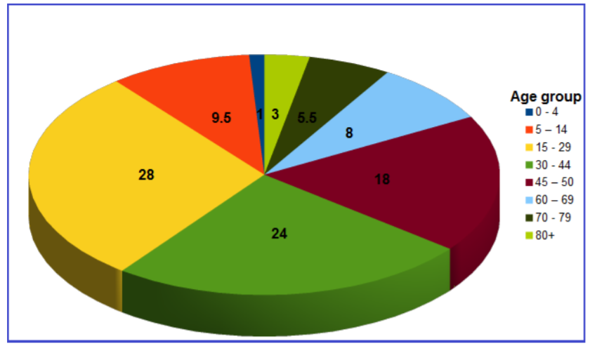](https://github.com/zubairwazir/FlaskNewsApp/tree/main/images/data.png)

## OBJECTIVE 

1) To research accidents data of Pakistan in order to highlight the importance of the problem.
2) To implement the system which is able to monitor the driver’s behavior during driving.
3) In depth analysis of the system and design and implementation in engineering perspective.
4) Implementation of a novel alarming system to wake up drivers on time.


## METHODOLOGY

## RESULTS

> As from training session we can see the overall accuracy and loss of our model. For training session, we give 25 epochs. In first epoch the accuracy was 79% while in last epoch accuracy reached almost 99%.

[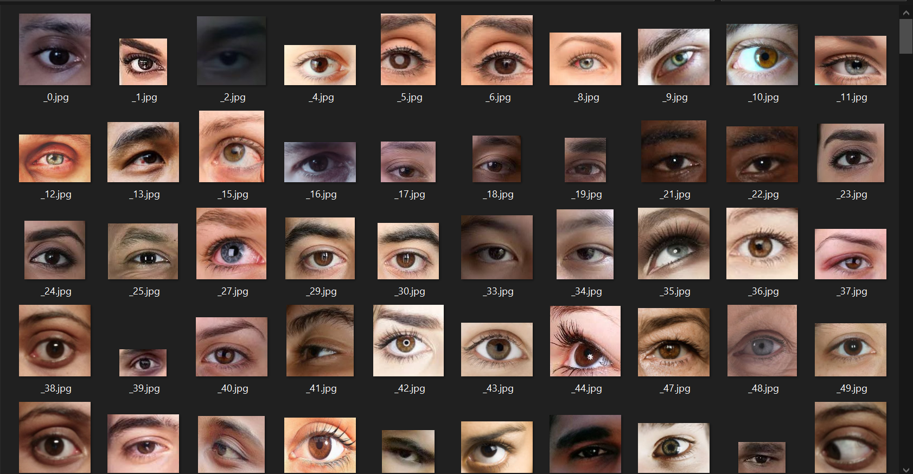](https://github.com/zubairwazir/FlaskNewsApp/tree/main/images/open.png)

[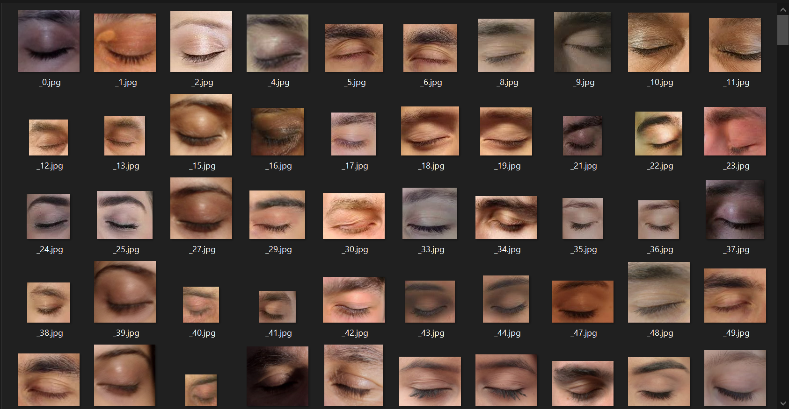](https://github.com/zubairwazir/FlaskNewsApp/tree/main/images/close.png)

[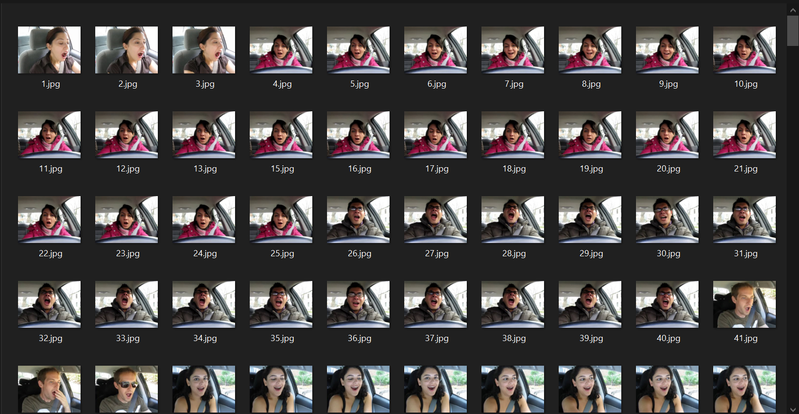](https://github.com/zubairwazir/FlaskNewsApp/tree/main/images/yawn.png)

[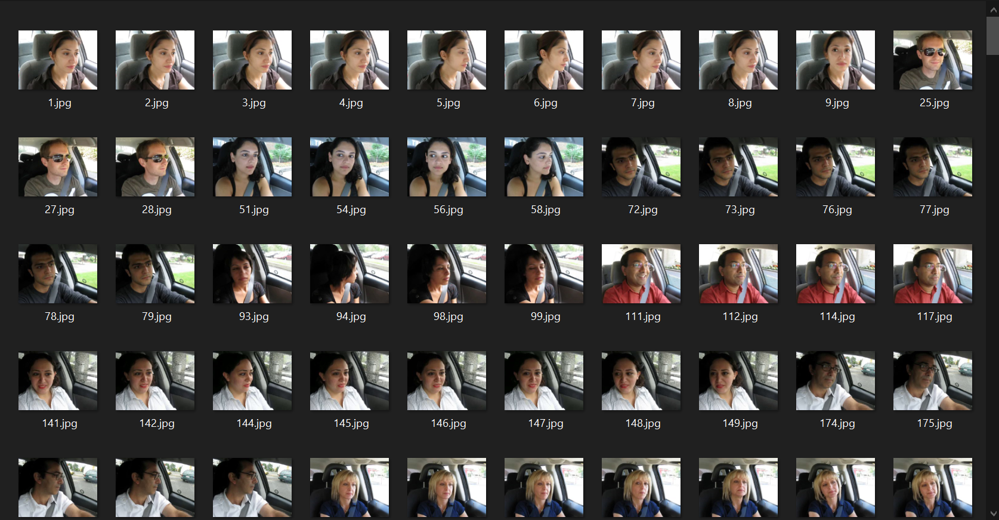](https://github.com/zubairwazir/FlaskNewsApp/tree/main/images/noyawn.png)

<p float="middle">
  
  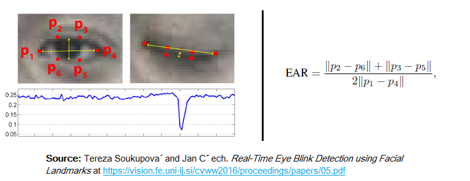 
</p>

<p float="middle">
  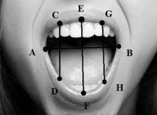
  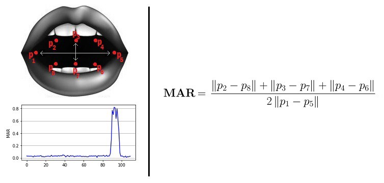 
</p>


[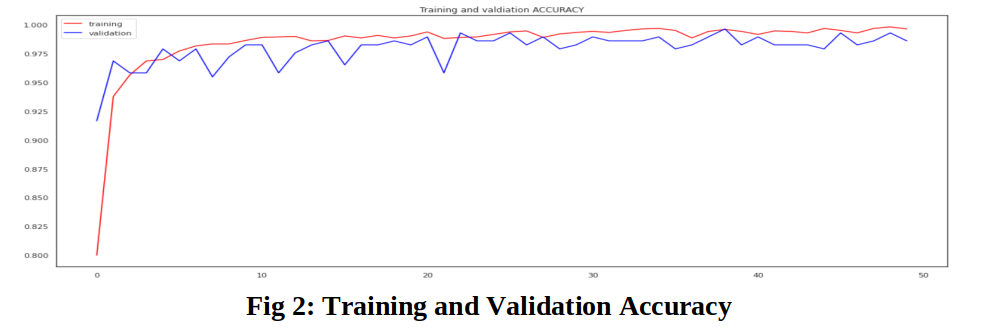](https://github.com/zubairwazir/FlaskNewsApp/tree/main/images/training1.png)

[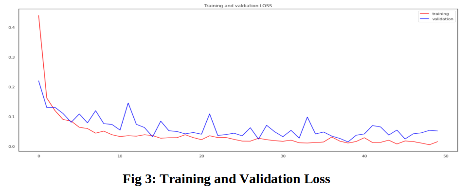](https://github.com/zubairwazir/FlaskNewsApp/tree/main/images/testing1.png)

<p float="middle">
  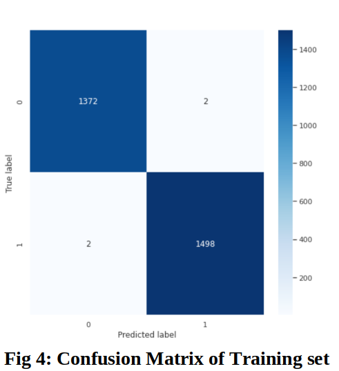
  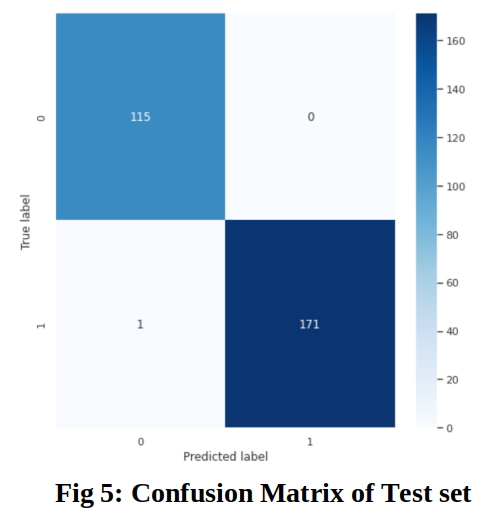 
</p>


## LIVE TESTING RESULTS

[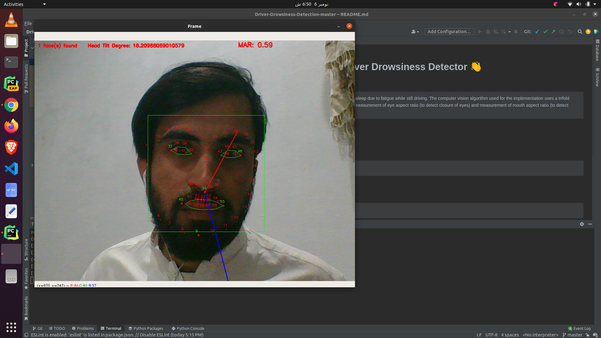](https://github.com/zubairwazir/FlaskNewsApp/tree/main/images/normal.png)

[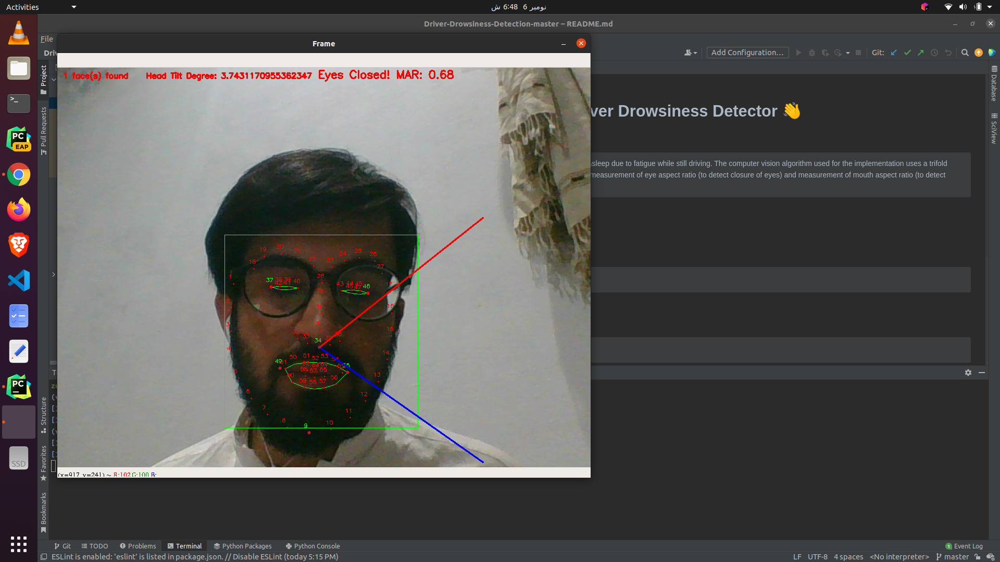](https://github.com/zubairwazir/FlaskNewsApp/tree/main/images/blinking.png)

[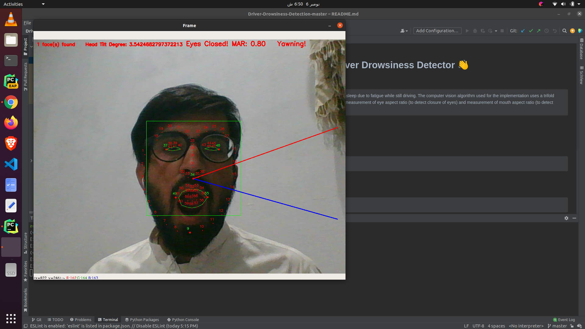](https://github.com/zubairwazir/FlaskNewsApp/tree/main/images/closing.png)

[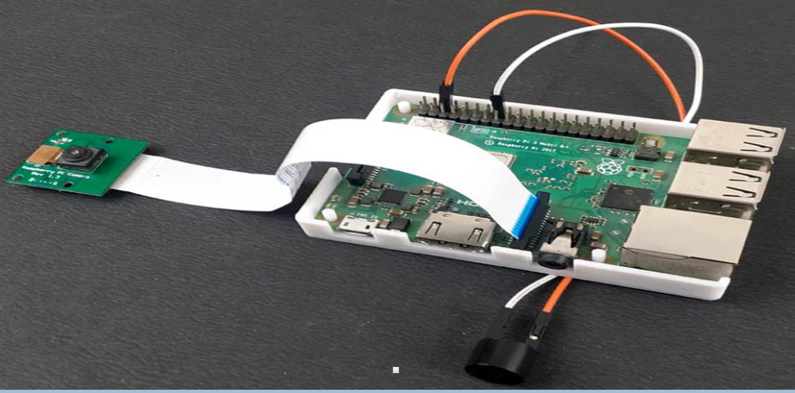](https://github.com/zubairwazir/FlaskNewsApp/tree/main/images/raspberry.png)

## DISCUSSION

> By calculating the aspect ratio of the eyes and the mouth, we can perform closed eye detection and yawn detection. We have developed efficient face detection and tracking method using CNN model trained by 2900 images of eyes and mouth. By collecting training and testing data from different subjects, we evaluated the performance of the system under different conditions and settings. The improvement in performance due to the evaluating and model tuning is attested through the increase in classification accuracy of the system. We achieved important objectives that were introduced at the beginning of our designing process: reliability, accuracy and speed of the system. In other words, the overall goal of the system was to try and meet those constraints as best as possible. We have also integrated the system with a small-scaled Raspberry PI and shown its applicability during driver’s drowsiness.

## CONCLUSION & FUTURE WORK

> In this work, we have made our system using facial expression recognition. We first obtained the face image and marked the key points of the eyes and mouth in the face image. This can reduce the scope of the eyes and mouth test and also avoid the interference of the background area in the image. we proposed two separate models for closing eye and yawning in order to achieve highest accuracy. We can improve this project by creating more data on our own and can use that data to prevents the models from over-fitting. Second, accident may occur if person is slow while responding to the warning signals that means person’s response sometimes is not enough to prevent accidents, even after being warned. So, one can avoid this kind of situations by designing and fitting a motor driven system which will slow down the vehicle automatically after getting warned. Third, we can make an Mobile App for the users which will provide all information regarding drowsiness or alertness levels during the journey using the information based on frames number which are captured.

## REFERENCES

> 1] Powell N.B. and Schechtman K.B. and Riley R.W, “The road to danger: the comparative risks of driving while sleepy,” The Laryngoscope, vol. 111, no. 5, pp. 887–893, May 2001.

> 2] World Health Organization, Global status report on road safety: summary. World Health Organization, 2009. [Online]. Available: http://books.google. com/books?id=FPIlAQAAMAAJ

> 3] Ahmed, A. (2007, June 21). Pakistan Road Safety. Scribd. Retrieved November 4, 2021, from https://www.scribd.com/doc/116044645/80894548- Pakistan-Road-Safety.


## Install

```sh
pip install -r requirements.txt
```

## Usage

```sh
python drowsiness_detection.py
```

## Author

👤 **Zubair Ahmad**

* Website: https://zubairwazir.github.io
* Twitter: [@zubairwazir777](https://twitter.com/zubairwazir777)
* Github: [@zubairwazir](https://github.com/zubairwazir)
* LinkedIn: [@zubair-ahmad-836325171](https://www.linkedin.com/in/zubair-ahmad-836325171/)

## Show your support

Give a ⭐️ if this project helped you!
